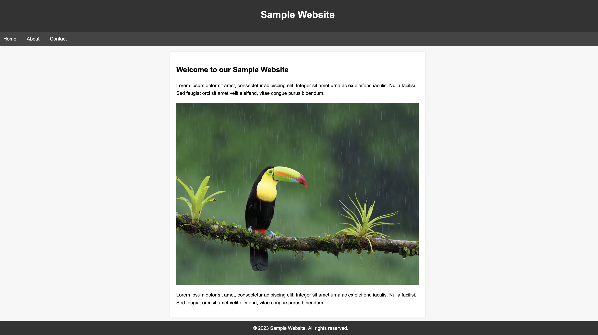

## Unit 1 Lesson 1 - Intro

What you will learn in this course:

* How to insert images into a website
* How to enter text on a website
* How to style your own website

When you are done, you will have completed your own website!

It will look something like this: 

### Before you begin, here are some rules that you need to follow while in the computer lab.

* No food is allowed in the lab. This is to keep the computers clean and working.
* Be careful when using the computers! This means no reckless or dangerous activities anywhere near a computer.
* Be respectful of others. This way, everyone gets to enjoy the program.

With that out of the way, let's begin! 