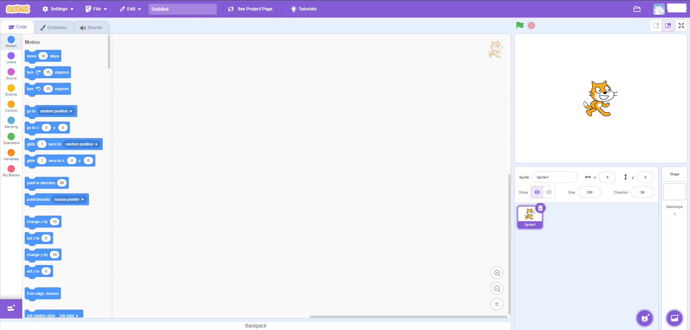
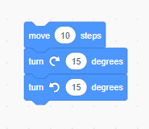

# Unit 2 Lesson 2: First Project

Now that you have created your Scratch account, let's create your very first project! First off, go to your Scratch account on this website if you haven't already:

> https://scratch.mit.edu/

On the home page, click the Create button on the top left of your screen. You should have been brought to this screen.

It may look scary at first, but let's explore the important parts of your workspace.

### Top Bar

At the top of your screen, you can see many options. The two we will explain are "File" and the project name.

First off, clicking the "File" dropdown will display multiple options. Let's quickly go over what these do.
 - **New**: quickly create a new project
 - **Save now**: save your progress into the project you are working on. **Forgetting to save will cause all of your progress to disapear, so it is important to save your progress!!!**
 - **Save as a copy**: save your progress into a separate project. This can be useful when you want to save but might also revert to the current state.
 - **Load from your computer**: load a project from your device
 - **Save to your computer**: save the project to your device

Now that we know what the "File" dropdown does, let's name our project. Click on the bar that currently says "Untitled" and enter something fun and exciting! Your project will now be called whatever you entered.

### Left Tabs

To the left of your screen is where the components of your projects will be.

By default, you will be looking at the "Code" tab (you can tell by looking at the directly below the top bar). This is where you can bring your projects to life! The little blocks that you see are colored based on what type of action the block does, and a key can be seen to the left of the blocks (try clicking on the circles). Inside each of these blocks is a tiny description of what the block does. Be sure to look over and read the text, so you don't use the wrong block! You might also notice that the blocks themselves aren't perfect rectangles. This is because these code blocks can "slide" into each other, creating a code block.

For example, this code block will move an object 10 steps, then turn the object 15 degrees clockwise, and finally turn the object 15 degrees counterclockwise.

Next, let's look at the "Costumes" tab (right next to the "Code" tag). This will allow you to create and edit sprites. Sprites are characters or objects that will be rendered onto the screen when you have created the game.

Finally, the "Sounds" tab is right next to the "Costumes" tab. This tab will allow you to add sound effects or music or just sound in general into your project.

### Middle Workspace

Let's go back to the "Code" tab. In the middle of your screen, you will see a white space. What a waste of space am I right? Well not really. This is where the project comes to life. Right now, there isn't much on the screen, but let's try dragging some code blocks into the space. First, click "Events" on the "Code" tab and drag the "when (green flag) clicked" block into the workspace. Next, click "Motion" and connect any of those blocks onto the end of the yellow block that we put intot he workspace earlier. Congratulations! You have successfully created your first Scratch program (Be sure to save by clicking "File" -> "Save now" to save the program).

### Right Project Execution

Finally, we have arrived at the right side of the screen. This is where you can see your project in real time. Let's try clicking the green flag at the top left of the right side of your screen. Because our code executes when the green flag is clicked, you should see the sprite move. Now try adding more code blocks into the workspace and playing around with the project! You can also manage your sprites and background at the bottom of the right side.

### Conclusion

That was a lot of information that we just went through, but you made it! Try playing around and get familiar with the tools that Scratch offers. For a challenge, try creating a program that makes the sprite walk in a "A" shape. Good luck and have fun!