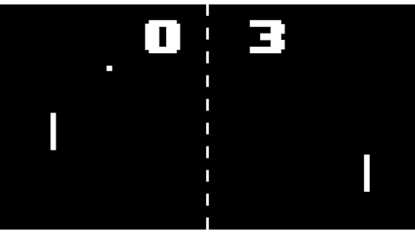

# Unit 2 Lesson 3: Planning

Now that you have a basic understanding of Scratch's components, let's start creating our game. We will be working on a game called Pong!

If you aren't familiar with pong, it's a game similar to table tennis. The white square represents a ball, and when it reaches one side, the other side gets a point. When the ball collides with the two long rectangles at either end, the ball will bounce off the rectangle and start moving in the other direction. The goal of the game is to score as many points as possible while blocking the ball from reaching your side of the screen.

That may have been a lot to digest, but it's very important to know exactly what we want to do. Let's digest the description of Pong above into a checklist.

In order to create Pong, we need:
 - two paddles, a ball, and a score counter
 - a way to move the ball
 - control over the two paddles
 - checks for when the ball hits the the border of the screen and/or the paddle
 - a scoreboard that keeps track of the score for each side

This list is much more understandable than the paragraph above isn't it? Planning out your projects helps you stay organized and helps you understand what you need to do in order to make your program successful. Now we know exactly what we need to do in order to create the game. In the next couple lessons, we will be working completing the items on the list, and at the end of this unit, you will have created your very own version of Pong!