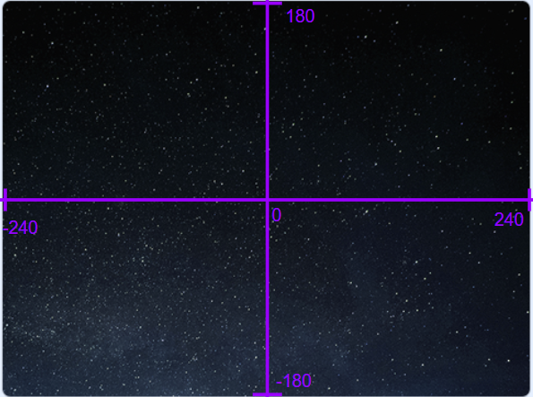

# Unit 2 Lesson 4: Sprites

If you look at the game preview in the top right, you'll notice that our game is pretty bland. The only thing that we have in our game right now is the default cat sprite. Remember, we can check our sprites in the area below the game preview.

First off, let's get a fun background for our game. Under the stage tab at the bottom right, click on "Backdrops 1" to change it. At the bottom left side of the screen, we can add a new backdrop. We can click "Choose a Backdrop" to pick from preset backdrops or click "Paint" to draw our own. In this example, we will use a preset backdrop called "Stars", but you can choose whichever one you want!

Let's go back to the list in the previous lesson and list out what sprites we need for Pong.

We need sprites for:
 - the ball
 - the two paddles
 - a score counter for both sides
 - a results screen

Let's change Sprite 1 (the cat) into our ball. With Sprite 1 selected, change to the "Costumes" tab on the left side of the screen, and add a costume at the bottom of the costumes bar on the left side of the screen. You can choose from a ton of different images using the "Choose a Costume" option or draw your own using the "Paint" option. In this example, we used a ball from the "Choose a Costume" option, but it can be anything you want. Once you click on the sprite you want to use as your ball, it will appear as one of your costumes. Since we won't be using the cat costumes and the ball won't be changing, you can delete the two cat costumes. You can change the name of your Sprite to something that represents the sprite. In our example, we called the ball sprite "Ball". Now, if you check our game, we will have our backdrop and a sprite for the ball!

Now that you know how to add sprites, we want you to add two more sprites. Name one of those sprites "Left Paddle" and name the other sprite "Right Paddle". These sprites will represent, the two paddles that the players will control. Once you have completed this, you can move on.

Have you added the two sprites? Great! Now we can move on! Next, we want to display which side won on the screen. In order to do so, we will use costumes! First, we will create our own sprite (select "paint") and call it "Result". Next, we will insert a text box (the big T) in the middle and type "Left Wins". At the top, we will rename this costume into "Left Wins", a name describing the costume's purpose. This will appear when the left side wins, but what about the right side? Well, we will create a costume for that too. You may have noticed that at the bottom of the costume bar, create a new costume and go through the same process, or right click your costume, click "duplicate", and change the information as needed. The duplicate function will come in handy when working with similar objects. Because we don't want this sprite to always show, under the sprite name, we can click the hide button to hide the sprite (the eye with a line over it).

Now that you know how to work with text, we want you to create a sprite for the left side's score called "Left Side Score" and a sprite for the right side's score called "Right Side Score". In our game, a player wins when they score 7 times, so the scoreboard only needs to go from 0 to 6. When the game starts, the score will show 0, so make sure that it is shown instead of hidden.

Once you have finished adding sprites for the two scores, we have added all the sprites we need! Now, you can drag the sprites around on the game preview to position them, but a more accurate way to position our sprites would be to define their x and y coordinates (next to the sprite name). Our game's coordinate system places the origin (0, 0) at the center of the screen, and the x value goes from -240 to 240 while the y value goes from -180 to 180.

Try positioning the sprites that we created so that it looks like a classic pong game. Don't forget the "Result" sprite (you can show by clicking the eye, but don't forget to hide it again).

Congratulations! You have now rendered all the sprites we need for the game! In the next couple lessons, we will program these sprites so that they can move around and interact with one another.