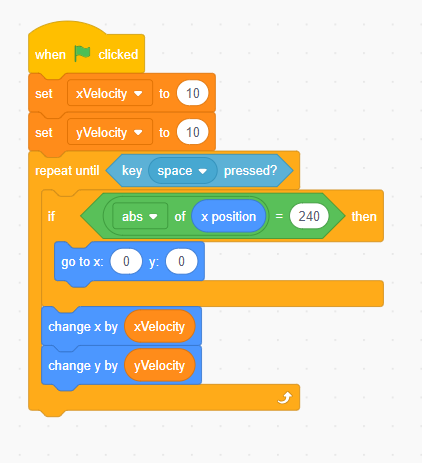
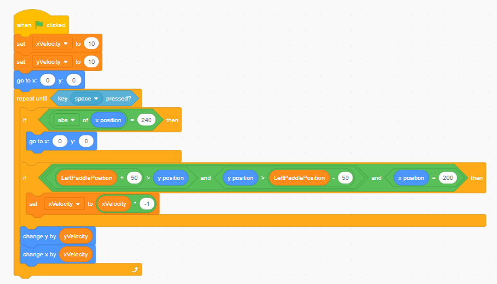
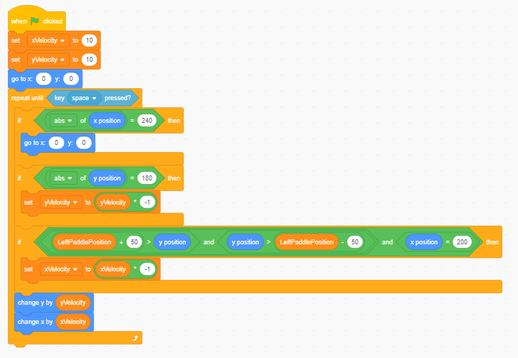
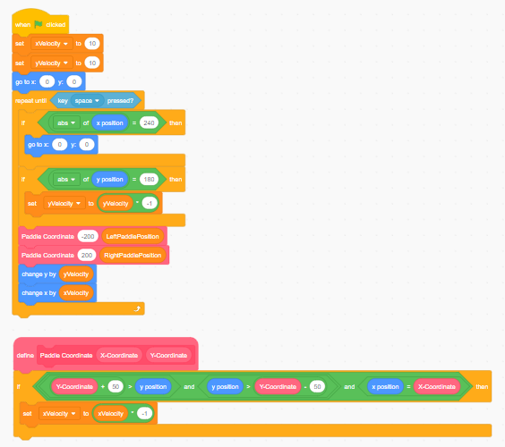

# Unit 2 Lesson 6: Detection

Each sprite that we have written code for is now able to move, but they aren't able to communicate with each other. A part of computer science is figuring out how components interact with each other and how to make use of these interactions.

In our case specifically, there are two important interactions that we will focus on for our Pong game. The first one is when the ball touches either one of the paddles. When this happens, we will need to reverse the direction of the ball to make it seem like the ball bounces off the paddle. The second interaction is when the ball touches the top, bottom, left, or right side of the screen. When the ball touches the top and bottom of the screen, we want the ball to bounce off, and when it touches the left and right side of the screen, we want to add a point to the scoreboard. Let's start off with the first task of when the ball touches the paddles.

First off, we'll need a way to transfer data between sprites. Now why is that? Well, we need to know the position of the paddle to determine if the ball is touching it, and currently our ball sprite only have the information of its own position. In order to transfer data between sprites, we will save the information into a variable. In "Left Paddle" sprite, we will add a variable.

To do this in Scratch:
1. go to the "Variables" section
2. click "Make a Variable"
3. type the name of the variable (we will use "LeftPaddlePosition" because it describes its own function)
4. make sure that "For all sprites" is checked (this is because we want all sprites to be able to access this information)
5. click "OK".

This will create a variable under the "Variables" section that we can use to transfer and store data! Now, let's store the y position of the paddle. Every time the paddle moves, we want to store the y coordinate information into the "LeftPaddlePosition" variable, which means the code block that updates information will be inside the loop. Right under the "repeat until" loop, let's add a set code block (under the "Variables" section) and set our variable to the y position (under the "Motion" section). Now, if you make sure that the "LeftPaddlePosition" checkbox is checked under the "Variables" section and move the left paddle, you will notice that the variable updates every time you move it. We can do the same thing for the right paddle to track its movements.

Now, let's go back to the ball sprite. This is where we will handle our logic for when the ball collides with the components of our game. Because our programming will be checking conditions for every single one of the scenarios described at the start of this lesson, we'll have a lot of conditionals, but we still want the ball to move. Therefore, let's move the code block that moves the ball outside of the "if else" statement so that it still moves even if a condition evaluates to true (still in the loop because we want the ball to continue moving) and change the "if else" statement to just an "if" statement. Because it deals with the ball colliding with the side of our game, we'll worry about that later.

For now, let's deal with how we're going to make the ball bounce off the paddles. In order to reverse the direction of our ball, we will have to make it move in the opposite direction.

> What is the opposite of moving 10 units in the x direction?

The answer is moving negative 10 units in the x direction. Now, notice how our ball's velocity is changing.

> What do we use to store data that changes?

That's right! We use variables to store data. In our case, we are going to use variables to store the velocity of our ball (velocity has speed and direction). Create a variable that stores our x velocity and a variable that stores our y velocity, and set both variables to 10 right when the flag is clicked. Because we have a variable for the velocity, change the "change x by ()" and "change y by ()" code blocks to change by the amount in our variable. Try to do this yourself, but we have attached our answer below.

Let's do something with that speed. When the ball bounces off the paddle, we are going to reverse the x velocity so that it moves in the opposite x direction. But how do we know when the ball collides with the paddle? Well, the ball collides with the paddle when the x and y variable are the same for the ball and the paddle. We know that the paddle is fixed on the x axis (it doesn't move horizontally), but our y axis is moving. That's why we have the variables that we set earlier, "LeftPaddlePosition" and "RightPaddlePosition"! But wait, our paddle is much larger than just one coordinate point. That's right! According to the size of our sprite (next to the "show/hide" option), our paddles' size is 100, so it stretches 50 points in the positive and negative y direction. That just means that the range of y axis for our ball to collide on is from our paddle's y-50 to y+50. Using the code blocks under "Operators" and our variables, try to make a block that represents when the ball is going to bounce off the left paddle. Then, put that block as a condition for an if statement and within the if statement, set the x velocity of our ball to itself times -1 (to reverse the direction). Finally, put that entire block right under our ball's first "if" statement and try it out. Our answer is below.

**Hint**: Because we haven't written some of the program, the ball may avoid detection. We will explore this in the next part.

**Note**: We added a block to center the ball right as the program runs for convenience.

If you tried to run the program, you'll notice that the ball doesn't bounce. Did you ask yourself why that is? Part of computer science is finding out where and why something broke. In our case, it's because our ball is actually clipping outside of our possible y values, so the paddle doesn't recognize the collision. Let's fix that by implementing our ball's collision with they top and bottom walls. It's very similar to how we handled detecting when the ball reached the left and right side of the screen. Try it out yourself!

Now if you run the program, you'll notice that not only does the ball bounce off every wall, it also bounces off the left paddle! At this point, we've done most of the work, but we forgot about the right paddle! Instead of duplicating the block that handles paddle collision and having to change the paddle position variables, let's try something different. We will use Scratch's version of a function, a "block". A function is essentially naming a block of code so that you don't have to write the code multiple times. It can also take in parameters, which are values that can change every time you call the function. Let's see this in action with "blocks".

Under the pink "My Blocks" section, click "Make a Block". Replace "block name" with a meaningful name, and click "Add an input" and call it "X-Coordinate". Add another input for the Y-Coordinate and click "OK". In your coding area, you'll notice that a "define" code block appears. Whatever we put under the "define" will run with the parameters we give it every time we call it. Move our paddle collision "if" statement under the "define" code block and replace the "LeftPaddlePosition" variables and the x-coordinate with the inputs we created. Under "My Blocks", drag two of our custom blocks and put it where our paddle detection used to be. Finally, input the x-coordinate of the left paddle and the "LeftPaddlePosition" for one of them and input the x-coordinate of the right paddle and the "RightPaddlePosition" for the other.

By using this technique, we avoid having to write the same code block for different parameters. Functions are especially useful when you are making large, repetitive, programs (imagine writing the same code 1000s of times!).

Congratulations! You have successfully implemented collision for the paddle, the ball, and the game itself while also learning important skills for computer science! In the next lesson, we will deal with the scoreboard and the results screen.