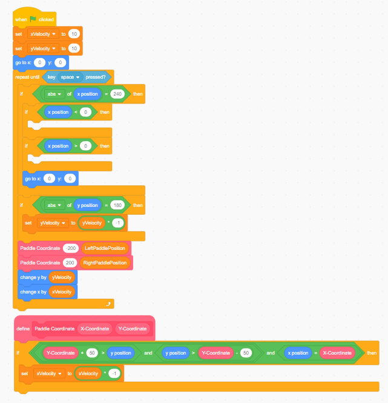
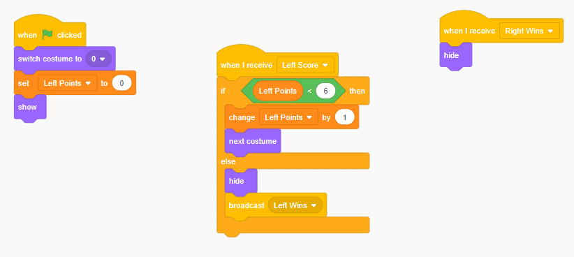
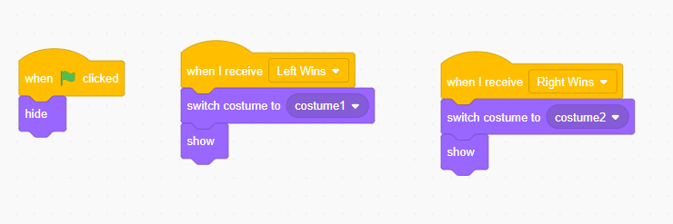

# Unit 2 Lesson 7: Finalizing Our Game

Now that we've dealt with how our components interact with each other, let's finish off our game in this lesson by completing the results screen and the scoreboard.

First off, let's tackle the scoreboard and start off with the left side score. Click the "Left Side Score" sprite to start coding the sprite. As always, we'll use the start block with the flag.

> What are some things that the score should do when the program starts?

Here's our list:
- reset the score
- switch from hide to show
- store the score into a variable

The score sprites itself won't be the one to determine the score, but it's the ball sprite that will determine whether a player scored or not. The left score will only increase when the ball touches the right side of the screen. Create an if statement which will run a block of code when the ball reaches the right side of the screen. Then, write another if statement that will run when the ball reaches the left side of the screen. Put both of these if statements in the appropriate locations.

**Hint**: You already have an if statement that checks when the ball touches the left or right side of the screen.

Now that we are able to differentiate when the left and right score, how do we tell our Score sprites that one side scored? In this situation, we could use a variable, but a better way would be to make a call (represented in Scratch by a "broadcast"). Because we don't need to transfer data and only need to tell components to do something, a call would fit better than a variable.

Under the "Events" section, use the code block that says "broadcast ()" and drag it into our if statement that will run when the ball hits the right side of the screen. Click the dropdown menu and click "new message". Then enter "Left Score" and click "OK". Now, whenever the ball hits the right side of the screen, the program will broadcast "Left Score" to all of our sprites, and we can then receive this call and do an action.

Now, there are a couple of things that we need to do in the "Left Side Score" sprite. We want you to try these tasks on your own, and then check your answer if you are stuck.

Back in the "Left Side Score" sprite, use the "when I receive ()" block under the "Events" section to receive the call. Now we can do something with the call. Our game ends at seven points, so use an "if else" statement to run a block of code when a new variable, "Left Score", is in a range from 0 to 6. Then, use the "next costume" block under the "Looks" section to change the score whenever a point is scored and the score is less than 6. When the score does get to 7, we want to hide the sprite ("hide" block) and then broadcast a message that says "Left Wins". Then, receive a message called "Right Wins" that will hide the "Left Side Score" sprite. Then, add a start block (the green flag) which will reset the costume to the 0 costume, reset the score to 0, and show the score counter.

If you have correctly completed the assignment, tested your program, and ensured that it works, copy the code to the right side (editing values as needed). We have successfully implemented the score! Now, let's work on the results screen.

We have a broadcast for when left side wins and for when right side wins. We want to show the correct costume when a side wins and hide the results screen when the game has started. Using everything you've learned up to now, try to implement this yourself.

Congratulations! You have now created a fully functioning Scratch game! In the next lesson, we will go through some next steps.